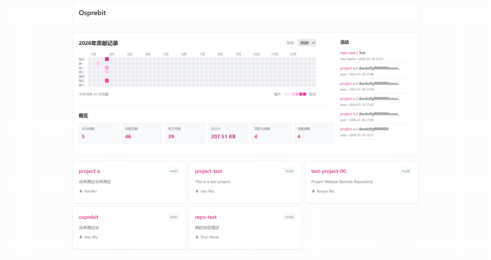

# Osprebit

<div align="center">


**轻量级自托管 Git Web 界面**

</div>

## 简介

Osprebit 是一个轻量级的自托管 Git Web 界面，基于现代 Python 技术栈构建。它提供了一个简洁、高效的 Web 界面来浏览和管理 Git 仓库。

## 功能特性

- 🌳 **仓库浏览** - 浏览仓库文件树和文件内容
- 📝 **提交历史** - 查看完整的提交历史和提交详情
- 🔥 **贡献热力图** - 可视化展示贡献活动
- 📊 **统计信息** - 仓库统计和概览信息
- 🔄 **Git 协议支持** - 完整支持 Git push/pull 操作
- 📦 **快照下载** - 支持下载仓库快照
- 🎨 **现代化界面** - 响应式设计，支持移动端
- ⚡ **高性能** - 基于 ASGI，支持高并发
- 🔧 **易于配置** - 简单的 TOML 配置文件

## 技术栈

- **Web 框架**: Litestar 2.19+
- **模板引擎**: Jinja2 3.1+
- **Git 操作**: pygit2 1.19+
- **ASGI 服务器**: Uvicorn
- **Python 版本**: 3.14+

## 截图



## 快速开始

### 安装
强烈建议在 Linux 系统中运行，确保已安装 `git`
```bash
# 克隆仓库
git clone https://codeberg.org/ortzikantu/osprebit.git
cd osprebit

# 创建虚拟环境
python -m venv .venv
source .venv/bin/activate

# 安装依赖
pip install -r requirements.txt
```

### 配置
创建配置文件 ~/.config/osprebit/config.toml：
```toml
[osprebit]
site_name = "Osprebit"
port = 6789
repo_path = "/path/to/your/repos"
base_url = "https://your-domain.com"
```
- `site_name` 设定站点名
- `port` 设定端口
- `repo_path` 设定裸仓库存放的位置，比如在家目录下创建repos文件夹，则可写 /home/git/repos
- `base_url` 设定域名，如果要部署到云服务器开放浏览的话

### 运行
```bash
# 开发模式
python -m uvicorn osprebit.app:app --host 0.0.0.0 --port 6789 --reload

# 生产模式
python -m uvicorn osprebit.app:app --host 0.0.0.0 --port 6789 --workers 4
```
访问 http://localhost:6789 即可查看界面。

### 创建裸仓库
Osprebit 需要使用 Git 裸仓库（bare repository）。创建裸仓库的步骤：
```bash
# 创建裸仓库目录
mkdir -p /path/to/your/repos/myproject.git
cd /path/to/your/repos/myproject.git

# 初始化为裸仓库
git init --bare

# 设置仓库描述（可选）
echo "我的项目描述" > description
git config --local repo.description "我的项目描述"

# 设置仓库所有者（可选）
git config --local repo.owner "Your Name"
```
### 配置令牌
服务运行起来后即可随意 Clone、Pull 仓库了，但 Push 需要进一步设置：
```bash
python get_token.py
```
这步命令用于生成一个具有三天有效期的Token，可以充当上传代码时的密码，下面是 Token 生成成功的反馈信息：
```bash
已加载配置文件: /home/git/.config/osprebit/config.toml
==================================================
Git 仓库认证令牌获取工具
==================================================

✅ 令牌已生成

令牌: hiedRKwnav64VnV7Iwiqs6MiCkO8CIrcTS6ca47Jilw

令牌信息:
  用户名: git
  创建时间: 2026-02-03 18:20:21
  过期时间: 2026-02-06 18:20:21
  有效期: 3 天

==================================================
注意事项:
==================================================
• 令牌有效期为 3 天
• 请妥善保管令牌，不要泄露给他人
• 令牌过期后需要重新获取
• 系统仅支持令牌认证，不再支持密码认证
• 如果遇到问题，请联系管理员
==================================================
```

## 许可证

本项目采用 [GPL-3.0-only](LICENSE) 许可证。

## 致谢

- [Litestar](https://litestar.dev/) - 现代化的 Python Web 框架
- [pygit2](https://www.pygit2.org/) - Python Git 绑定
- [Jinja2](https://jinja.palletsprojects.com/) - 模板引擎

## 联系方式

- 作者: Hao Wu
- 邮箱: hao.wu@ortzikantu.com
- 项目主页: https://codeberg.org/ortzikantu/osprebit
- 问题反馈: https://codeberg.org/ortzikantu/osprebit/issues

---

<div align="center">

**如果这个项目对你有帮助，请给个 ⭐️**

Made with ❤️ by Ortzikantu

</div>
